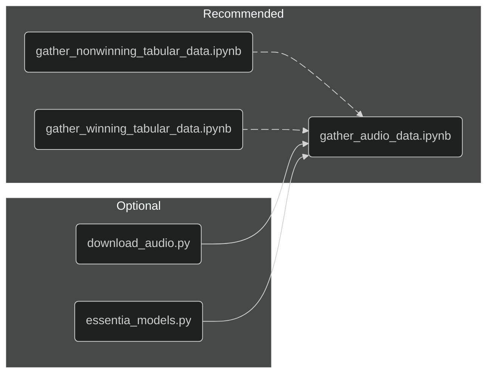

# LOVE DIVE into KPOP Music Show Winners

Korean pop, better known as KPOP, has become my most listened musical genre since diving into it in 2022. Prior to listening to KPOP, my musical preferences aligned with Hip-Hop and Rap while passively consuming the genre through some of my siblings interest in the genre. The group that initiated my launch into the genre was LE SSERAFIM and become a fan at the perfect time, before their 1st full length album. UNFORGIVEN offered something that was fresh, confident, and offered myself a journey to immerse in and learn from. 

From this album onward, I have developed my own preferences of tracks and hoped that groups would attain highly coveted music show wins. In Korea, there are several weekly music award programs, most notably *Music Bank* and *Ingikayo*. These award shows provide artists the ability to have their hard work recognized and highlighted to those tuning into the broadcast. Wins for comebacks are often the bane of every fandom debate and claiming that "*X is better than Y because that have Z wins compared to A wins*". As a result, I wanted to explore whether there are notable distinctions between award winning and non-winning KPOP songs starting from 2022 to the present. For this exploration, I want to primarily focus on the song itself, looking into song characteristics like danceability and potentially diving into sentiment analysis of lyrics.

## Structure

Rather than opting to put every component of the project into one main file, I wanted to establish different sections of the analysis into separate notebooks. Given this initiative, I tried to implore a naming convention that establishes the purpose for each notebook and what you can expect to observe. This analysis starts with the `gather_nonwinning_tabular_data.ipynb` and `gather_winning_tabular_data.ipynb` notebooks whose objective is to acquire the tabular data for Korean Music Award Show winners by scraping the data from Wikipedia and Kpopdb.net. It may seem that this step could have been made into one notebook or only scrape one website, but there were APIs that I found were recently deprecated or required subscriptions. Therefore, the overall idea and structure had to adapt to these circumstances resulting in the `gather_nonwinning_tabular_data.ipynb` notebook which doesn't contain any setup for API usage. 

After acquiring the tabular data, the next notebook is `gather_audio_data` which acquires the audio data for the songs found in the tabular data scraped in the previous steps. The audio data is important because it offers an avenue for analysis through **Essentia** models. The core intention for extracting song characteristics derived from Spotify's API and I found out a week after starting this project that it is now deprecated. Additionally, I attempted to shift to MusicXMatch but was let down to find that the endpoint I was interested in required a paid subscription. Consequently, I searched for different pivots and came across Essentia models which I can perform inference on to extract song characteristics. While the results from these models may appear to be a bit skewed, especially for the entire genre of KPOP songs, they offer a great alternative to resources that are no longer supported.

Currently, I have some optional notebooks in `download_audio.py` and `essentia_models.py` that offer utility to my notebooks and seeks to reduce the redundancy within my codebase. Additionally, there is the `melon_flask.py` that isn't utilized by any notebook (as of 4/22/25) but may provide seamless service to acquire chart data or potentially lyrics to explore sentiment analysis on songs.

The file structure and order in which they should be explored can be explained by this diagram.

