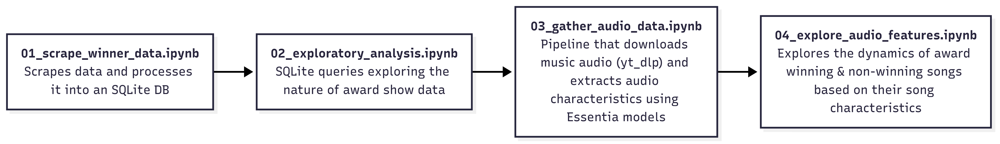

# LOVE DIVE into KPOP Music Show Winners

Korean pop, better known as KPOP, has become my most listened musical genre since diving into it in 2022. Prior to listening to KPOP, my musical preferences aligned with Hip-Hop and Rap while passively consuming the genre through some of my siblings interest in the genre. The group that initiated my launch into the genre was LE SSERAFIM and become a fan at the perfect time, before their 1st full length album. UNFORGIVEN offered something that was fresh, confident, and offered myself a journey to immerse in and learn from. 

From this album onward, I have developed my own preferences of tracks and hoped that groups would attain highly coveted music show wins. In Korea, there are several weekly music award programs, most notably *Music Bank* and *Ingikayo*. These award shows provide artists the ability to have their hard work recognized and highlighted to those tuning into the broadcast. Wins for comebacks are often the bane of every fandom debate and claiming that "*X is better than Y because that have Z wins compared to A wins*". As a result, I wanted to explore whether there are notable distinctions between award winning and non-winning KPOP songs starting from 2022 to the present. For this exploration, I want to primarily focus on the song itself, looking into song characteristics like danceability and potentially diving into sentiment analysis of lyrics.

## Structure

This project is structured in separate folders: `data`, `essentia_models`, `notebooks`, and `scripts`. If you want to dive straight into the analysis, you can explore the numbered notebooks found in the `notebooks` folder, which streamlines the overall process of obtaining, cleaning, and analyzing both the data about award show wins and audio characteristics. The `data` folder contains all of the scraped and processed data, including a clean SQL table that you can use to explore the data. The `scripts` and `essentia_models` define functions and classes that are crucial for running the notebooks, providing a backbone for the overall analysis.

## Citations

This project makes use of pre-trained deep learning models provided by the [Essentia](https://essentia.upf.edu) library.

Dmitry Bogdanov, Alastair Porter, Perfecto Herrera, and Xavier Serra.  
"Cross-collection evaluation for music classification tasks."  
Proceedings of the 19th International Society for Music Information Retrieval Conference (ISMIR 2018).