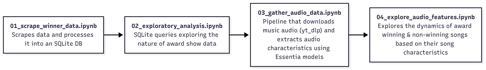

# What Makes a K-pop Song a Winner? 
### *A Data-Driven Analysis of Music Show Champions (2023-2025)*

## Introduction

Korean pop, better known as KPOP, has become my most listened musical genre since diving into it in 2022. Prior to listening to KPOP, my musical preferences aligned with Hip-Hop and Rap while passively consuming the genre through some of my siblings interest in the genre. The group that initiated my launch into the genre was LE SSERAFIM and become a fan at the perfect time, before their 1st full length album. UNFORGIVEN offered something that was fresh, confident, and offered myself a journey to immerse in and learn from. 

From this album onward, I have developed my own preferences of tracks and hoped that groups would attain highly coveted music show wins. In Korea, there are several weekly music award programs, most notably *Music Bank* and *Ingikayo*. These award shows provide artists the ability to have their hard work recognized and highlighted to those tuning into the broadcast. Wins for comebacks are often the bane of every fandom debate and claiming that "*X is better than Y because that have Z wins compared to A wins*". As a result, I wanted to explore what characteristics tend to make a K-pop track more likely to win a music show. We will explore whether certain shows provide groups an edge, ideal group types, and audio profiles.

## Project Overview

This project combines web-scraped data and Spotify audio features to uncover trends among 220+ winning and 200+ non-winning K-pop songs (2023–2025).

By merging award show data with track-level audio characteristics, I analyzed patterns in artist types, genre prevalence, and musical features that correlate with success on Korea’s top weekly music programs.

## Key Questions
- Are certain music shows more likely to favor specific artist types (solo vs. group vs. coed)?
- Do audio features like danceability, energy, or tempo correlate with winning tracks?
- How do release timing or group composition (gender, debut year) affect win likelihood?

## Methodology

This project is structured in separate folders: `data`, `essentia_models`, `notebooks`, and `scripts`. If you want to dive straight into the analysis, you can explore the numbered notebooks found in the `notebooks` folder, which streamlines the overall process of obtaining, cleaning, and analyzing both the data about award show wins and audio characteristics. The `data` folder contains all of the scraped and processed data, including a clean SQL table that you can use to explore the data. The `scripts` and `essentia_models` define functions and classes that are crucial for running the notebooks, providing a backbone for the overall analysis.

- Data Collection
    - Scraped weekly K-pop music show winner data (Wikipedia, KPOPDB) using BeautifulSoup
    - Extracted YouTube track links and Spotify metadata (yt_dlp, Spotify API)

- Data Cleaning & Integration
    - Standardized artist and title naming, corrected data types, and applied manual fixes using Excel and Pandas
    - Merged datasets and engineered features using Polars & SQL

- Feature Extraction
    - Retrieved 10 deep audio features (e.g. danceability, energy, valence) using pre-trained Essentia models
    - Joined dataset with an excel file of artist metadata (e.g. group composition, debut date)

- Exploratory Analysis
    - Conducted statistical summaries and visualizations using scipy and Polars
    - Compared winning vs. non-winning tracks using Matplotlib & Seaborn

## Key Insights
- **Trend #1**: Female groups account for consistently higher win shares in Inkigayo (0.6+ in 2023, 0.5 in 2024) while Male Groups dominate The Show!, Music Bank, and Show Champion in win shares.
- **Trend #2**: The Show! serves as a gateway stage for rookie artists, rewarding newer acts who haven’t yet built large fanbases but demonstrate breakout potential. M Countdown and Music Bank's win distributions are more spread to artists who are 0-8 years old, indicating that these shows may be more difficult to win at.  
- **Trend #3**: Winning K-pop tracks balance familiarity with emotional restraint. Success is driven by relatability and polish rather than raw emotional experimentation. Tracks with moderate valence and energy scores tended to win more often, supporting the idea that emotional restraint and polish resonate more with mainstream audiences.
- **Trend #4**: Genre success is tied to mastering the genre's "production formula", not breaking it. Emotional and technical consistency signals refinement, while excessive experimentation runs the risk of diluting genre identity.

## Next Steps

- Automate weekly data ingestion using Airflow or a cloud function

- Expand historical coverage to include 2018–2025

- Build a Tableau dashboard to visualize trends interactively

- Host cleaned data on BigQuery or Kaggle for reproducibility

## Citations

This project makes use of pre-trained deep learning models provided by the [Essentia](https://essentia.upf.edu) library.

Dmitry Bogdanov, Alastair Porter, Perfecto Herrera, and Xavier Serra.  
"Cross-collection evaluation for music classification tasks."  
Proceedings of the 19th International Society for Music Information Retrieval Conference (ISMIR 2018).

Additional artist metadata was sourced from [SoriData](https://soridata.com/), accessed October 2025.